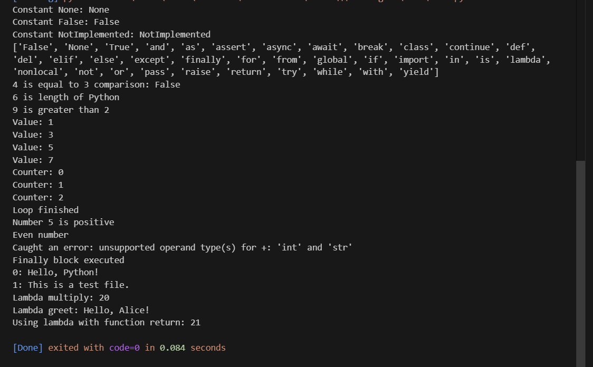

# Звіт до роботи
## Тема: Основи програмування Python
### Мета роботи:Навчитись застосовувати основні конструкції мови Python, виконати всі приклади та з використанням AI створити власні приклади, які демонструють особливості кодових конструкцій Pyhton


---
### Виконання роботи
* Результати виконання завдання *1-8*;
    1. Програма вивела значення:
    1. Отримав наступні результати: Програма працює правильно,код спрацював у всіх методах виклику.Весь код для 8 завдань успішно працює.
    1. Ознайомився та навчився використовувати основні конструкціїї мови Python,виконкав всі поставлені завдання,а також створив приклади від ШІ,які демонструють особливості кодових конструкцій Python
* вставлені рисунки   
    
    

* вставлений код / текстовий або числовий результат / інші результати:
    - #4
numbers = [1, 3, 5, 7]

for n in numbers:
    print(f"Value: {n}")
i = 0
while i < 3:
    print(f"Counter: {i}")
    i += 1
else:
    print("Loop finished")

* результати виконання індивідуального завдання (якщо такі є);

---

### Про основи програмування на Python від ШІ

> Запитання: Запитайте у АІ як би він розписав про основи Python (задайте промпт вказавши що ви вивчаєте Python з використанням Jupyter Notebook). Спробуйте виконати приклади Python коду та вставте їх відповіді у звіт?

```
Основи Python
1. Змінні

Змінні — це іменовані сховища для даних. Python сам визначає тип змінної.

# Присвоєння значень змінним
x = 10          # ціле число
y = 3.14        # число з плаваючою точкою
name = "Alice"  # рядок
is_active = True  # булевий тип (True/False)

print(x, y, name, is_active)

2. Типи даних

Основні типи даних у Python:

int — цілі числа

float — числа з плаваючою точкою

str — рядки

bool — булевий тип

list — списки

dict — словники

a = 5           # int
b = 2.5         # float
c = "Hello"     # str
d = True        # bool

print(type(a), type(b), type(c), type(d))

3. Списки (list)

Списки — це впорядковані колекції елементів.

fruits = ["apple", "banana", "cherry"]
print(fruits)

# Доступ до елементів
print(fruits[0])  # перший елемент
print(fruits[-1]) # останній елемент

# Додавання та видалення
fruits.append("orange")
fruits.remove("banana")
print(fruits)

4. Словники (dict)

Словники зберігають дані у форматі ключ: значення.

person = {
    "name": "Alice",
    "age": 25,
    "city": "Kyiv"
}

print(person["name"])  # доступ по ключу
person["age"] = 26     # зміна значення
person["job"] = "Engineer"  # додавання нового ключа
print(person)

5. Цикли
Цикл for
fruits = ["apple", "banana", "cherry"]
for fruit in fruits:
    print(fruit)

Цикл while
count = 0
while count < 5:
    print("Count:", count)
    count += 1

6. Розгалуження (if, elif, else)
age = 18

if age < 13:
    print("Child")
elif age < 18:
    print("Teenager")
else:
    print("Adult")

7. Функції

Функції дозволяють структурувати код.

def greet(name):
    return f"Hello, {name}!"

print(greet("Alice"))

# Функція з кількома параметрами
def add(a, b):
    return a + b

print(add(5, 3))

8. Лямбда-функції

Лямбда-функції — короткі однорядкові функції.

# Звичайна функція
def square(x):
    return x**2

# Лямбда-функція
square_lambda = lambda x: x**2

print(square(5))
print(square_lambda(5))

# Використання у списку
nums = [1, 2, 3, 4]
squared_nums = list(map(lambda x: x**2, nums))
print(squared_nums)

9. Робота з файлами

Python дозволяє читати та писати файли.

# Запис у файл
with open("example.txt", "w") as f:
    f.write("Hello, world!\n")
    f.write("Python is awesome.")

# Читання з файлу
with open("example.txt", "r") as f:
    content = f.read()
    print(content)
```
### Висновок:
> ---

## 1. Що було виконано в роботі
- Вивчено основні типи даних у Python: `int`, `float`, `str`, `bool`, `list`, `tuple`, `dict`, `set`.  
- Відпрацьовано використання умовних операторів (`if`, `elif`, `else`).  
- Виконано практичні приклади циклів `for` та `while`.  
- Ознайомлено з лямбда-функціями та стандартними вбудованими функціями (`abs`, `len`, `round`).  
- Реалізовано приклади роботи з файлами за допомогою контекст-менеджера `with`.  
- Вивчено обробку помилок через конструкцію `try → except → finally`.  
- Створено власні приклади коду з використанням AI для демонстрації можливостей Python.  

## 2. Чи досягнуто мети роботи
Мета роботи досягнута: опановано базові конструкції Python, створено власні приклади коду та виконано всі поставлені завдання.  

## 3. Нові знання, отримані під час роботи
- Розуміння основних типів даних та структур у Python.  
- Навички застосування циклів і умовних конструкцій.  
- Вміння створювати та використовувати лямбда-функції.  
- Знання про роботу з файлами та обробку помилок.  
- Досвід використання AI для генерації власних прикладів коду.  

## 4. Чи вдалося відповісти на всі поставлені питання
Так, усі питання щодо типів даних, циклів, умовних операторів, функцій та обробки помилок були розглянуті та опрацьовані.  

## 5. Чи виконані всі завдання
Так, усі лабораторні та додаткові практичні завдання виконані успішно.  

## 6. Чи виникали труднощі під час виконання завдання
- На початку виникли незначні труднощі з імпортом функцій (`randint`) та синтаксисом лямбда-функцій.  
- Всі проблеми були успішно вирішені.  

## 7. Чи подобається формат виконання роботи (Feedback)
Так, формат з поетапним виконанням прикладів у Jupyter Notebook і використанням AI для генерації власного коду є зручним і наочним.  

## 8. Побажання щодо покращення (Suggestions)
- Додати більше практичних завдань на комбінування різних конструкцій (цикли + умовні оператори + словники).  
- Включати короткі пояснення до кожного прикладу прямо у ноутбуку для кращого розуміння.  
- Додати вправи з використанням модулів і бібліотек Python для практичного застосування знань.
