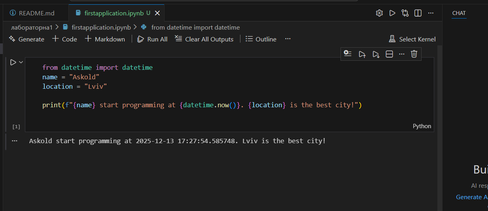
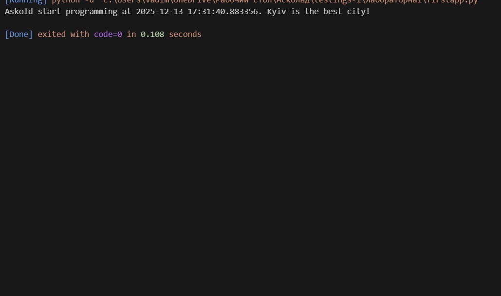

# Звіт до роботи
## Тема: Вступні заняття: налаштування середовища, прочаток роботи з Python та Markdown
### Мета роботи: Налаштувати середовище роботи VS Code, створити репозиторій Github та налаштувати інтеграцію з ним, написати першу програму на Python та створити звіт з використанням форматування Markdown;


---
### Виконання роботи
* Результати виконання завдання *1*;
    1. Розробив мою першу програму написану на Python.
    1. Програма вивела  наступне значення: Askold start programming at 2025-12-13 17:27:54.585748. Lviv is the best city!
    1. Отримав наступні результати: Програма працює правильно,код спрацював у всіх методах виклику:<<Terminal,bash,jupyter>> файл з розширенням <<ipynb>> також вивів результат
    1. Навчився налаштовувати середовище робиоти VS Code та створювати репозиторії в Github
* вставлені рисунки  
    

* вставлений код / текстовий або числовий результат / інші результати:
    -from datetime import datetime
name = "Askold"
location = "Kyiv"
print(f"{name} start programming at {datetime.now()}. {location} is the best city!")

* результати виконання індивідуального завдання (якщо такі є);

---

### Перша програма штучного інтелекту (ChatGPT)

> Запитання: Яку б першу програму написав штучний інтелект та чи міг би він її пояснити?

```python
Я б почав із найпростішої та корисної програми, яка показує базові ідеї Python. Класичний варіант — “Hello, world!”, а потім одразу щось трохи практичніше.

1️⃣ Перша програма: Hello, world!
print("Hello, world!")


Пояснення:

print() — це функція, яка виводить текст на екран

"Hello, world!" — це рядок (текст)
👉 Мета цієї програми — перевірити, що все працює і познайомитись із синтаксисом.
```
### Висновок:
> у висновку відповідаю на запитання:

 - :question: **Що виконано в роботі:** у межах роботи було створено першу програму на Python, яка коректно запускалася та працювала без помилок.  
- :question: **Чи досягнуто мети роботи:** так, поставлену мету було успішно реалізовано.  
- :question: **Які нові знання отримано:** опановано роботу з середовищем Jupyter, створення комірок з кодом і Markdown, а також запуск програм і перегляд результатів їх виконання.  
- :question: **Чи вдалося відповісти на всі питання, поставлені в ході роботи:** так, на всі питання було надано відповіді.  
- :question: **Чи вдалося виконати всі завдання:** так, усі завдання виконано в повному обсязі.  
- :question: **Чи виникали труднощі під час виконання завдання:** ні, процес виконання не викликав складнощів.  
- :question: **Чи подобається такий формат здачі роботи (Feedback):** так, оформлення звіту з використанням Markdown є зручним і цікавим.  
- :question: **Побажання щодо покращення (Suggestions):** доцільно було б додати більше прикладів інтерактивного використання Markdown та Jupyter під час підготовки звітів.

